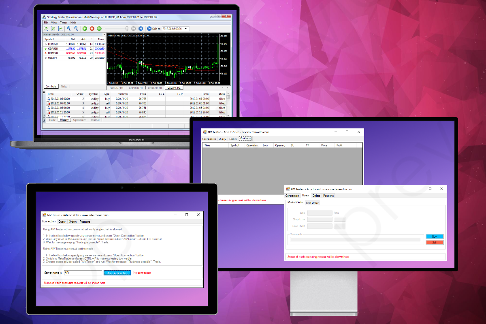

# MetaTrader 5 - Trading Panel

Trading panel that allows manual testing in MetaTrader 5 and simulate real time trading in testing mode, including setting different position volumes, stop losses, take profits, displaying open positions and pending orders. 
Also, this panel can be used as an alternative to the standard one provided with MT5 by default. 

# Preview

# Links

- https://www.youtube.com/watch?v=shHEjUIRyj0
- https://www.youtube.com/watch?v=Cyyy5sD7jqo

